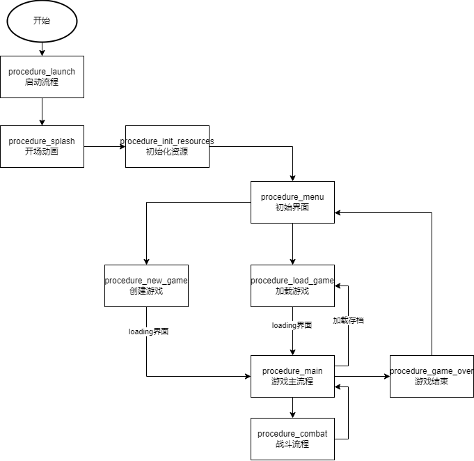
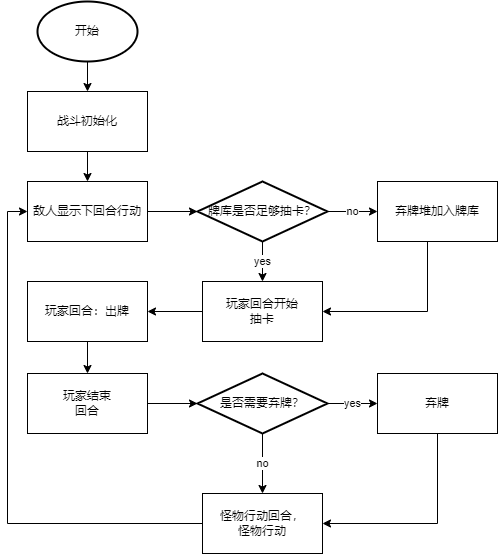

# card_roguelike

## 介绍

仿《杀戮尖塔》的卡牌构筑`rogue like`游戏。

## 游戏流程

## 战斗流程

## 计划内容

- 基于卡牌的回合战斗系统
  - 牌组的随机和管理
  - 卡牌的CSV配置，数据驱动
  - 抽牌、出牌、弃牌等基础操作
- 可扩展的AbilitySystem技能系统
  - 抽象BUFF
  - 属性管理`Attribute`
- 可预测的怪物AI（基于行为树）

## 美术资源

游戏美术资源均来自于[itch.io](itch.io)。

本人尽可能选用免费资源用于教学目的。如果有付费资源也都是本人购买后使用。

请同学们尊重作者劳动权益，不要转卖。

需要商用请在网站上付费购买。
